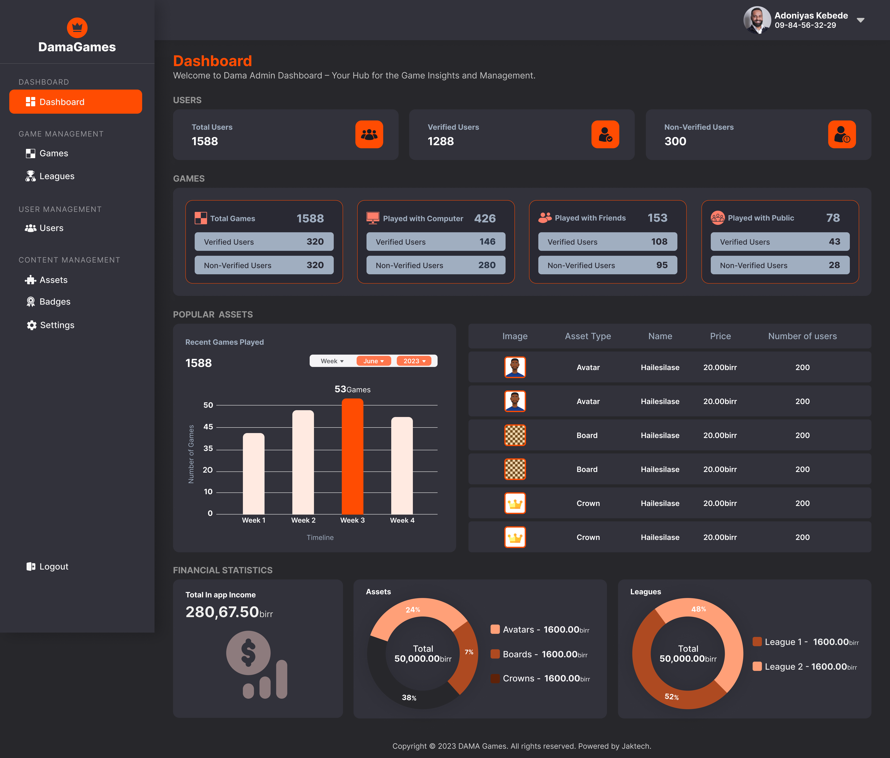

# DamaGames


DamaGames is a simple multiplayer Progressive Web Application (PWA) checkers game built using React and TypeScript. The repository is organized into separate folders for the backend, frontend, socket, and admin.

## 📂 Project Structure

- **frontend**: The main player-facing application.
- **admin**: The admin interface for managing the game assets, analitics and managment tools.
- **backend**: Server-side logic and database interactions.
- **socket**: Real-time communication between players using WebSockets.

## 🌐 Frontend

The frontend is built with React and TypeScript, providing a smooth and interactive user experience for playing checkers online with friends or other players.

### Features

- **Play with computer**: Play checkers with the machine
- **Multiplayer Gameplay**: Play checkers with others in real-time.
- **PWA**: Installable on devices for a native app-like experience.
- **Leagues**: League games where players join a league and play with eachother for a price
- **Payment Integration**: Uses [telebirr](https://www.ethiotelecom.et/telebirr) to facilitate payment

### PWA APP Screenshots


## 🔧 Admin

The admin interface is also built with React and TypeScript, allowing administrators to manage the game, including player statistics, game settings, payments and more.

### Features

- **User Management**: Manage player accounts and statistics.
- **Game Settings**: Configure game rules, assets and settings.
- **Real-Time Monitoring**: Monitor active games and players in real-time.

### Admin Site Screenshots




# docker-compose-traefik

A basic example of a reverse proxy using Docker Compose and [Traefik](https://traefik.io/traefik/).

## Quick concepts

Under normal circumstances in local development, I might serve a Laravel application and a Vue application on `localhost` but under two different ports. For example, `:8081` and `:8082`. This usually isn't a big deal, but it can sometimes cause conflicts as most browsers consider _different ports equal to separate top-level domain names_. Meaning things like cross-site cookies and some authentication methods might not work as intended.

What Traefik does is act as a reverse proxy. It maps all port `:80` traffic on the machine running it, to itself. From there, you configure specific domain names or paths to attach to the services in your Docker setup. Traefik determines what service to forward a request to depending on the value of the URL being used, and sends it to the appropriate container accordingly!

## Getting started

Clone this repo, and ensure that the dependencies are installed. From the command line at the project root:

```
cd backend && composer install
cd frontend && npm install
cd admin && npm install
cd socket && npm install


```

### Environment variables and secrets

Set up the following environment variables and secrets

| Name          | Default  | Description                           |
| ------------- | -------- | ------------------------------------- |
| APP_ENV       | dev      | dev or prod?                          |
| DB_CONNECTION | mysql    | type of database                      |
| DB_HOST       | database | hostname of database                  |
| DB_PORT       | 3306     | db port                               |
| DB_DATABASE   | dama     | name of the database                  |
| DB_USERNAME   | dama     | database username                     |
| DB_PASSWORD   | SECRET   | secret to define the db user password |
|               |          |                                       |

### GitHub deployment variables and secrets

| Name            | Default       | Description                                               |
| --------------- | ------------- | --------------------------------------------------------- |
| REMOTE_HOST     | damagames.com | FQDN of linux server                                      |
| REMOTE_USER     | root          | user on linux server                                      |
| SSH_FINGERPRINT |               | ssh-keyscan damagames.com                                 |
| SSH_PRIVATE_KEY | SECRET        | ssh-keygen -m PEM -t rsa -b 4096 + ~/.ssh/authorized_keys |
|                 |               |                                                           |

Then, bring everything up with Docker Compose:

```
docker-compose up -d
```

Using the values provided by default, two sites should now be available for you in the browser.

- [app.localhost](http://app.localhost): The JavaScript (Vue) app
- [app.localhost/api](http://app.localhost/api): The PHP (Laravel) app

## Making changes

If you'd like to change those domains, take a look at the **labels** attribute values in the `docker-compose.yml` file. Specifically, the value for `Host()` and `PathPrefix()`.

## End-to-end Testing with Playwright

### install

```sh
yarn

```

### run tests

in VS Code with Playwright Extension or

```sh
yarn playwright test
```

## Problem?
