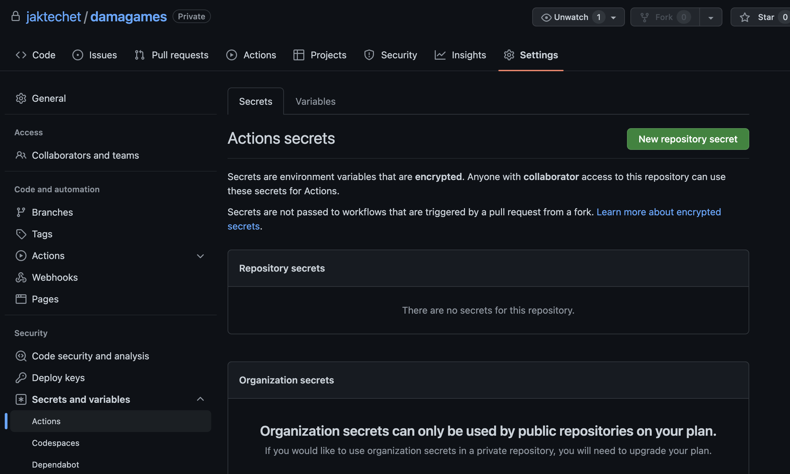
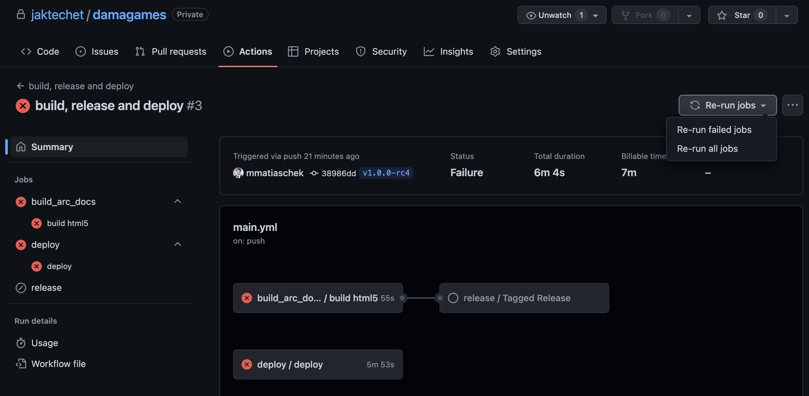

= DAMA Operations

:toc:
:toclevels: 1
:toc-title: Contents

:source-highlighter: rouge

// numbering chapters from here on
:numbered:

== Overview

DAMA is a multiplayer platform for playing checkers online against friends or other unknown players.

=== Systems

* Production server damagames.com
* GitHub repository 

=== Owners, Operators and Contacts

Product owner is Eyob Atnafu

|===
| System | Owner | Operator | Contact

| damagames.com
| Eyob
| Yohahannes Mekonnen (jaktech.et)
| contact

| GitHub repo
| Amanuel
| GitHub
| https://github.com/jaktechet/damagames
|===

=== Operation Times

24/7

=== System Classification

Progressive Web App with Laravel and node.js websocket backend

=== Systems History

* 19.01.2022 CI/CD setup of production backend at damagames.com

=== Revisions History

* v0.1 initial version

=== Restore / Recovery Tests

TODO

=== Compliance

TODO: which Ethiopian laws for data protection etc. apply?
TODO: which compliance regulations regarding VAS apply?

==== GDPR / DSGVO

* does not apply

== Systems Architecture and Interfaces

Details of the architecture are documented in the solutions architecture PDF document.

=== External Interfaces (to other Organisations)

.scope and context diagram
plantuml::../diagrams/scope_context.puml[png]

==== ethiotelecom VAS

TODO

==== GitHub

GitHub is set up to build and deploy DAMA to the damagames.com prod server via docker-compose and ssh.

=== Internal

no interface to other jaktech or damagames systems.

=== Inbound Interfaces

plantuml::../diagrams/overview.puml[png]

== Installation and Systems Requirements -- Server

Ubuntu 20.04 with following packages installed

apt install docker.io docker-compose

=== DNS Setup 

System needs domain and subdomai wildcard

for example 

damagames.com and *.damagames.com or test.damagames.com & *.test.damagames.com

DNS is hoted on namecheap.com by username damagames 

=== Non-default Systems Parameters

Set up the following environment variables and secrets

|===
| Name | Default | env | Description

| APP_ENV
| staging
| yes
| local, staging or production

| DB_CONNECTION
| mysql
| static
| type of database

| DB_HOST
| database
| static
| hostname of database

| DB_PORT
| 3306
| static
| db port

| DB_DATABASE
| dama
| static
| name of the database

| DB_USERNAME
| dama
| static
| database username

| DB_PASSWORD
| SECRET
| env
| secret to define the db user password

| PORT
| 3000
| static
| defines on which port socket.io runs - needs to be same as docker config

| REACT_APP_FRONTEND_URL
| damagames.com / ${REMOTE_HOST}
| env
| Frontend needs the URL for sharing game with other players

| REACT_APP_FRONTEND_URL
| api.damagames.com / api.${REMOTE_HOST}
| env
| Frontend needs the URL to the API

| REACT_APP_GTM_ID
| https://github.com/jaktechet/damagames/settings/variables/actions/GTAG_ID
| env
| Google Analytics gtag.js config id from damagamescom@gmail.com https://analytics.google.com/

| REACT_APP_SOCKET_URL
| damagames.com / ${REMOTE_HOST}
| env
| URL of the websocket server that the frontend uses

| REACT_APP_SOCKET_PORT
| 443
| static
| Port of the websocket server that the frontend uses

|===

==== CORS

needs setting up of backend/ cors.php
socket/server.js
also
socket.io.js in frontend

.env.example 

=== Storage

=== 3rd Party Tools

==== GitHub deployment variables and secrets

|===
| Name | Default | Description

| REMOTE_HOST
| damagames.com
| FQDN of linux server

| REMOTE_USER
| root
| user on linux server

| SSH_FINGERPRINT
|
| ssh-keyscan damagames.com excute your terminal so you can generate fingerprint

| SSH_PRIVATE_KEY 
| SECRET
| ssh-keygen -m PEM -t rsa -b 4096 && cat ~/.ssh/id_rsa.pub >> ~/.ssh/authorized_keys

|
|
|
|===

=== Installation

==== Server

* create SSH keys
* add pub key to ~/.ssh/authorized_keys

==== GitHub

Setup the above variables and secrets in the GitHub repository under Settings: 

=== First Start

Let's encrypt certificates and MySQL/MariaDB database with tables are set up automatically.

TODO: any other configuration needed, for example URLs to websocket?

== Build and release

=== Release management

=== Build

workflow .github/workflows/main.yml is triggered when a semver tag is pushed.

== Installation and System Requirements - Client

=== Client Hardware Requirements

=== Released Operating Systems and Version

=== 3rd Party Apps Client

=== Non-default Client Parameters

=== Installation Client

Users are asked if they want to install Dama by the PWA

== Overview of Installed Development, Test and Productive Environments

|===
| Env | Url

| dev
| only local development systems

| test
| TODO

| prod
| damagames.com
|===

=== Interface Configuration

== Starting and Stopping Operation

=== Initial Start of Operation

[source,yaml]
----
include::../../.github/workflows/docker_deploy.yml[docker_deploy.yml workflow definition]
----

=== Regular Startup Und Shutdown

Regular startup should be done via GitHub workflows.

Shutdown can be done via docker stop commands.

example
[source%linenums,shell]
----
docker ps -a
docker stop dama_php_1
docker stop dama_redis_1
docker stop dama_nginx-frontend_1
docker stop dama_database_1
docker stop traefik
docker stop damagames_api_1
docker stop damagames_socket_1
docker stop damagames_frontend_1
docker stop damagames_database_1
docker ps
docker rm traefik
docker rm damagames_api_1
docker rm damagames_socket_1
docker rm damagames_frontend_1
docker rm damagames_database_1
docker ps -a
docker rm 2ebc6454390b_damagames_traefik_1
----

=== Planned Shutdown and Restart

TODO: define maintenance shutdowns

=== Unplanned Shutdown (crash)

After an unplanned shutdown the system should start up automatically again. If not, the GitHub workflow docker_deploy.yml 'Deploy Docker Containers' can be run manually from the GitHub UI.

.re-run from GitHub UI

== Running Operations

=== Day to Day Operations

=== Monthly Plan

=== Usermanagement

=== Permanent Background Processes, Inbound and Outbound

=== Daily, Weekly, Monthly and Other Repeating Tasks

=== Backup

==== Storage

==== Database

=== Monitoring,  Maintenance and Escalation

== (Key) Performance Indications

=== Application KPIs -- Server

=== KPIs -- Client

== Known Limitations

=== Functional Limitations

=== Technical Limitations

=== Limitations from Capacity

== Archiving and Deleting Data

=== Transaction Data (fast Growing Data)

=== Master Data (slowly Growing Data)

=== Log Files and Error Files

=== Capacity Management

=== Capacity Recording and Monitoring

=== Regular Review of Capacity Utilization

=== Corrective Action to Eliminate Misuse

=== Capacity Planning

== Attachments

=== Solution Architecture

=== ReleaseNotes

